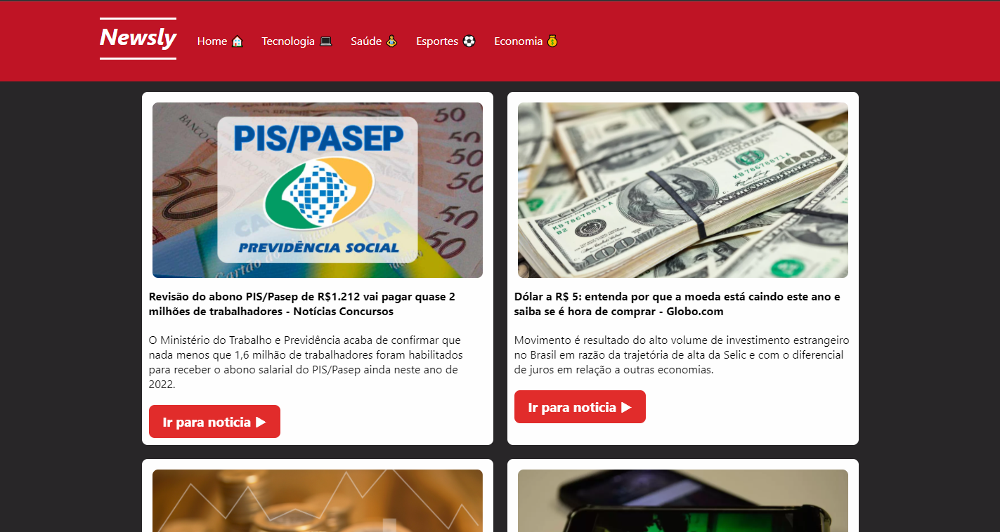

# Newsly - Portal de notícias



###  Opa oi oi! Esse é um projeto de consumo de API desenvolvido em React utilizando Typescript e styled-components.

## 👨‍💻 Linguagens, ferramentas e bibliotecas utilizadas:

- React
- Typescript
- Styled-Components
- React Router
- Framer Motion

## 📱 Dispositivos homologados:

A aplicação opera nas seguintes dimensões de telas:

- 1440px
- 720px
- 600x

## 💻 Pré-requisitos
- Você deve ter o Node instalado em sua máquina
- Você deve ter acesso a um termial (Git bash, powershell, cmd, vscode)

## 🚀 Instalando o Newsly na sua máquina
### Para instalar o Newsly, siga as etapas abaixo:


Insira o códgio abaixo no seu terminal para clonar o projeto

```
git clone https://github.com/gabezrodz/newsly.git
```
Então, navegue pelo terminal até a pasta do projeto e instale as dependências com o código abaixo 

```
npm install
```
## ☕ Usando o Newsly
Após o termino da instalação, use o código abaixo e aplicação irá abrir automaticamente em seu navegador favorito


```
npm start
```

